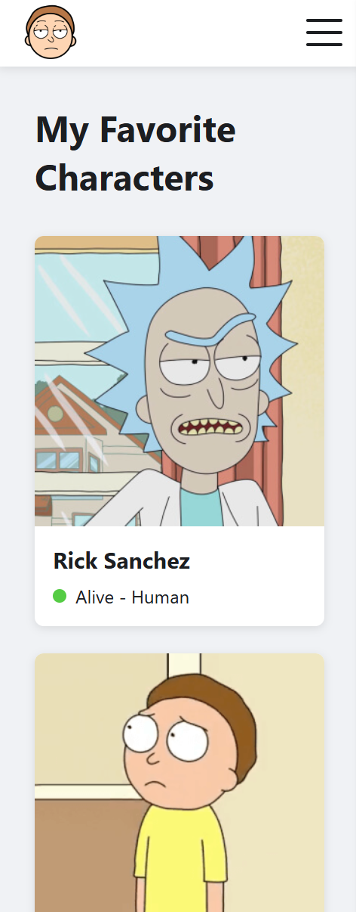
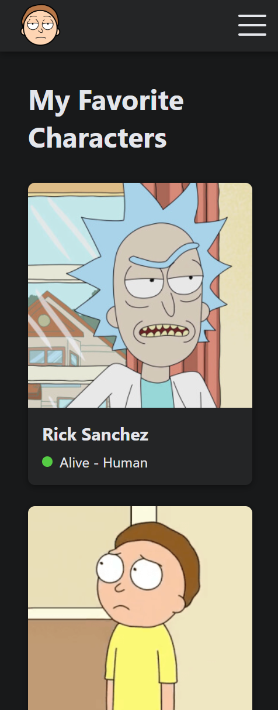

# Rick & Morty Universe Explorer

A responsive Single Page Application (SPA) built with React and TypeScript that allows users to explore characters from the Rick and Morty show. The app features API integration, light/dark themes, multi-language support, and a favorites system.

### 🚀 Live Demo

**[Rick & Morty Universe Explorer - Live Site](https://rick-morty-explorer.netlify.app/)**

---

### 📸 Screenshots

**Desktop View** 
<table><tr>
  <td></td>
  <td></td>
</tr></table>


**Mobile View**  
<table><tr>
  <td></td>
  <td></td>
</tr></table>


---

### ✨ Features

- **Responsive Design:** Fully compatible with desktop, tablet, and mobile devices.
- **3+ Pages:** Home, Characters, Character Detail, and Favorites pages.
- **API Integration:** Fetches data from the [Rick and Morty API](https://rickandmortyapi.com/).
- **Routing:** Uses `react-router-dom` for seamless client-side navigation.
- **State Management:** Built entirely with functional components and React Hooks (`useState`, `useEffect`, `useContext`, etc.).
- **Custom Hooks:**
  - `useApi`: For handling API requests, loading, and error states.
  - `useTheme`: Manages the application's theme.
  - `useLanguage`: Manages the application's language.
  - `useLocalStorage`: A generic hook to persist state in the browser's local storage.
- **Storage Interaction:** Uses `localStorage` to save user preferences for theme, language, and favorite characters.
- **Bonus - Theming:** Switch between **Light** and **Dark** themes.
- **Bonus - Multi-Language:** Switch between **English** and **Georgian**.
- **Bonus - SCSS:** Styled using the SCSS preprocessor for more organized and powerful CSS.

---

### 🛠️ Technology Stack

- **Framework:** [React](https://reactjs.org/) (via [Vite](https://vitejs.dev/))
- **Language:** [TypeScript](https://www.typescriptlang.org/)
- **Routing:** [React Router DOM](https://reactrouter.com/)
- **Styling:** [SCSS/SASS](https://sass-lang.com/)
- **API Client:** Native `fetch` API
- **API:** [The Rick and Morty API](https://rickandmortyapi.com/)

---

### 📂 Project Structure

The project follows a standard feature-based folder structure to ensure scalability and maintainability.

```
/src
|-- /api                 # API call services
|-- /assets              # Static assets (images, fonts)
|-- /components          # Reusable UI components (Button, Card, Header)
|-- /context             # React Context providers (Theme, Language, Favorites)
|-- /hooks               # Custom React hooks
|-- /i18n                # Internationalization/translation files
|-- /pages               # Page-level components
|-- /styles              # Global SCSS files (variables, mixins)
|-- /types               # TypeScript type definitions
|-- App.tsx              # Main App component with routing
|-- main.tsx             # Application entry point
```

---

### 🚀 Getting Started

To run this project locally, follow these steps:

1.  **Clone the repository**
    ```bash
    git clone https://github.com/[YOUR_GITHUB_USERNAME]/[YOUR_REPO_NAME].git
    ```
2.  **Navigate to the project directory**
    ```bash
    cd rick-and-morty-explorer
    ```
3.  **Install dependencies**
    ```bash
    npm install
    ```
4.  **Start the development server**
    ```bash
    npm run dev
    ```
The application will be available at `http://localhost:5173`.


### 👨‍💻 Author

- **Luka Orjonikidze**  
[GitHub Profile](https://github.com/LukaOrjonikidze)
